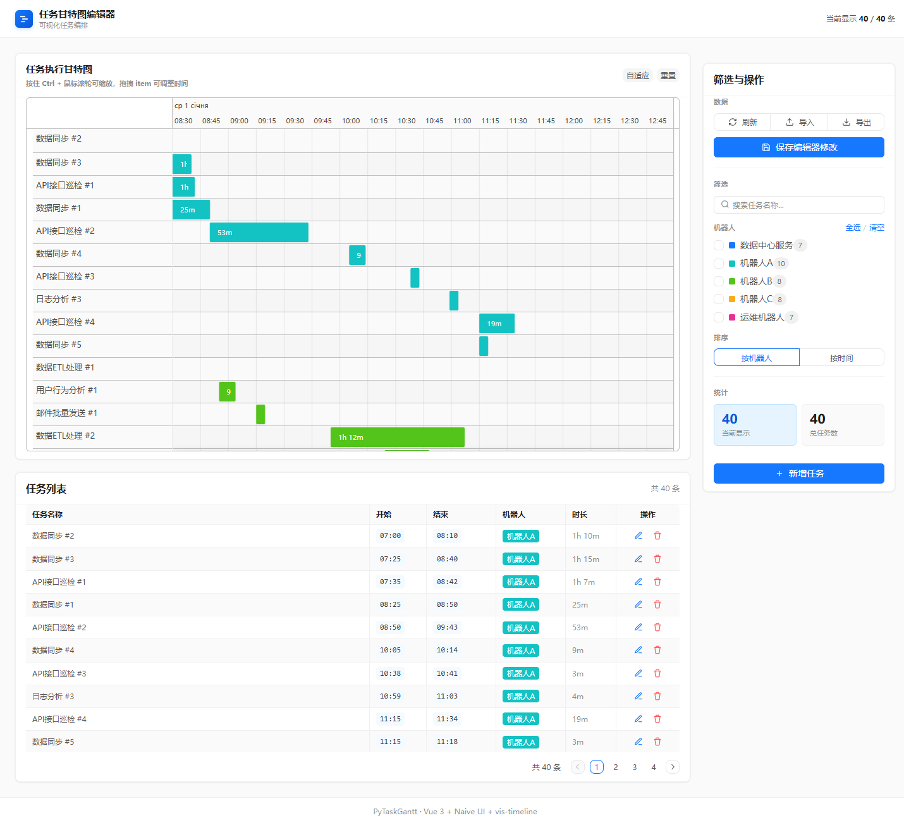
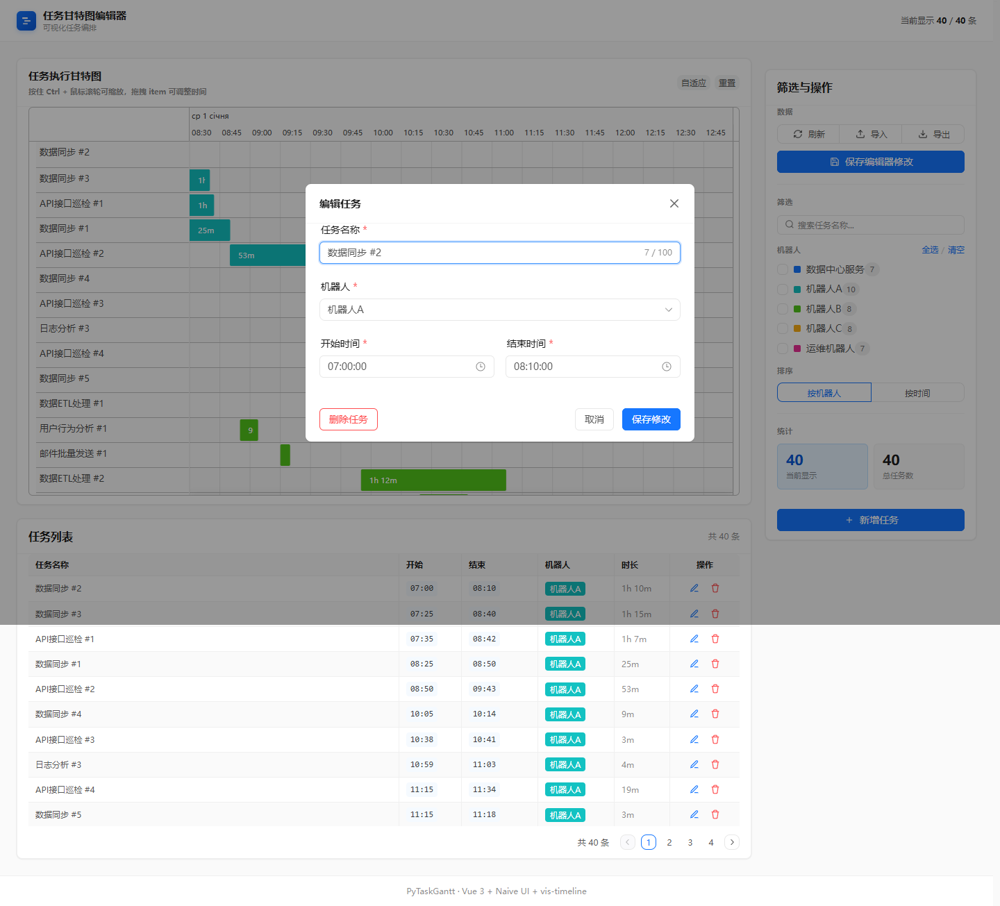
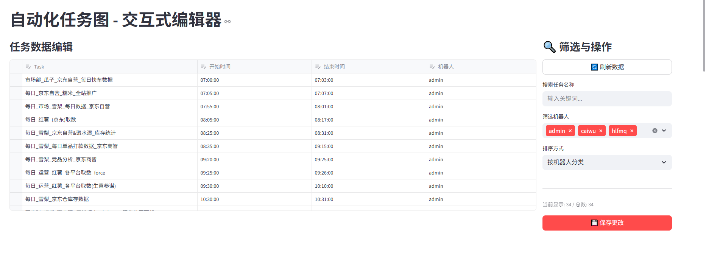
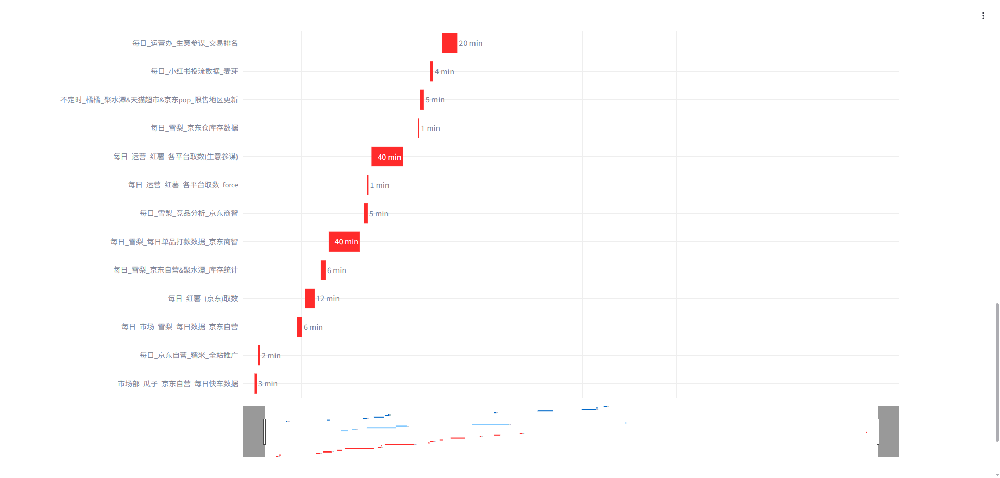

# PyTaskGantt · 交互式任务甘特图编辑器

一个用于可视化自动化任务计划的甘特图仪表盘，专为 RPA / 多机器人任务编排场景设计。

## 📦 版本选择

| 版本 | 目录 | 技术栈 | 定位 |
|------|------|--------|------|
| **Vue 版本（首选）** | [vue/](./vue/) | Vue 3 + Naive UI + vis-timeline + Express | AntD 企业风、拖拽编辑、轨道独立行、边缘自动滚动 |
| Streamlit 版本 | [streamlit/](./streamlit/) | Python + Streamlit + Plotly | 单文件部署、纯 Python 工作流 |

## 🚀 快速开始

### Vue 版本（首选）

```bash
cd vue
cp .env.example .env   # 首次运行：拷一份默认配置（端口/CORS）
npm install
npm start              # concurrently 同时拉起后端与前端
```

也可以分别启动：

```bash
npm run server  # 终端1：Express 后端 API
npm run dev     # 终端2：Vite 前端
```

默认端口：后端 `3002`、前端 `5174`。端口、host、CORS、**数据文件路径**均由 `vue/.env` 控制，详见 `vue/.env.example`。把 `TASKS_FILE` 改成绝对路径即可让后端读写任意磁盘位置的 `tasks.json`。

### Streamlit 版本

```bash
cd streamlit
copy .env.example .env   # 首次运行：拷一份默认数据源配置
start.bat   # Windows：uv 一键启动
```

或手动运行：

```bash
cd streamlit
uv run --with streamlit --with pandas --with plotly streamlit run create_gantt.py
```

访问：http://localhost:8501

Streamlit 版本的数据文件路径由 `streamlit/.env` 的 `TASKS_FILE` 控制；相对路径以 `streamlit/` 目录为基准，也支持绝对路径。例如：

```env
TASKS_FILE=../ShadowBot_tasks.csv
TASKS_FILE=D:/data/tasks.csv
```

---

## 📸 效果预览

### Vue 版本（首选）

#### 主界面：甘特图 + 任务列表 + 筛选面板
AntD 企业风精修：每个任务独占一行的 vis-timeline、配色一致的机器人色块、统计双色卡、未保存红点提示。支持鼠标拖拽改时间，拖到视窗边缘会自动平移并把任务条带走。



#### 任务编辑器
Modal 表单：任务名、机器人（可输入新机器人 tag）、起止时间（HH:MM:SS），跨天任务自动识别并提示时长。



---

### Streamlit 版本

#### 表格编辑界面
类似 Excel 的表格编辑，实时同步甘特图。



#### Plotly 甘特图
交互式图表，支持缩放和筛选。



---

## 📊 数据格式

两个版本使用相同的 CSV 数据格式（Vue 版本另以 JSON 持久化在 `vue/src/data/tasks.json`）：

```csv
Task,Start,Finish,Bot
数据同步#1,09:00:00,09:25:00,机器人A
日志分析#1,10:00:00,10:30:00,机器人B
```

| 字段 | 说明 |
|------|------|
| Task | 任务名称 |
| Start | 开始时间 (HH:MM:SS) |
| Finish | 结束时间 (HH:MM:SS) |
| Bot | 机器人 / 执行者名称 |

跨天任务：若 `Finish < Start`，会被识别为跨越午夜，时长自动按「次日」计算。

## ✨ 功能对比

| 功能 | Vue 版本 | Streamlit 版本 |
|------|:--------:|:--------------:|
| 甘特图可视化 | ✅ | ✅ |
| 鼠标拖拽改时间 | ✅ | ❌ |
| 拖到边缘自动滚动视窗 | ✅ | ❌ |
| 任务表单编辑 | ✅ | ✅ |
| 任务列表表格 | ✅ | ❌ |
| 搜索 / 多选机器人筛选 | ✅ | ✅ |
| 排序（按机器人 / 时间） | ✅ | ❌ |
| 数据保存到磁盘 | ✅ | ✅ |
| CSV / JSON 导入导出 | ✅ | ✅ |
| 未保存提示 | ✅ | ❌ |

## 📁 项目结构

```
PyTaskGantt/
├── README.md                  # 项目主文档
├── ShadowBot_tasks.csv        # 示例 CSV 数据
├── images/                    # README 截图
├── vue/                       # Vue 版本（首选）
│   ├── package.json
│   ├── .env.example           # 环境变量模板（实际 .env 不入库）
│   ├── server.cjs             # Express 后端，端口读 .env 中的 PORT
│   ├── start.bat              # Windows 一键启动
│   ├── vite.config.js
│   └── src/
│       ├── App.vue
│       ├── main.js
│       ├── theme.js           # Naive UI AntD 风主题覆盖
│       ├── style.css
│       ├── components/        # GanttChart / TaskEditor / TaskList / FilterPanel
│       ├── services/          # dataService (API + 工具函数)
│       └── data/tasks.json    # 数据持久化文件
└── streamlit/
    ├── .env.example           # Streamlit 数据源配置模板
    ├── start.bat              # Windows uv 一键启动
    ├── create_gantt.py        # 主程序
    └── ShadowBot_tasks.csv    # 数据文件
```

## TODO

- 数据导出为图像
- 界面美化
- 数据库支持

## 📝 License

MIT
