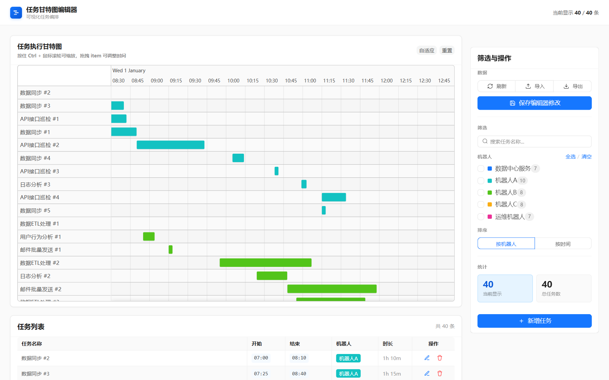
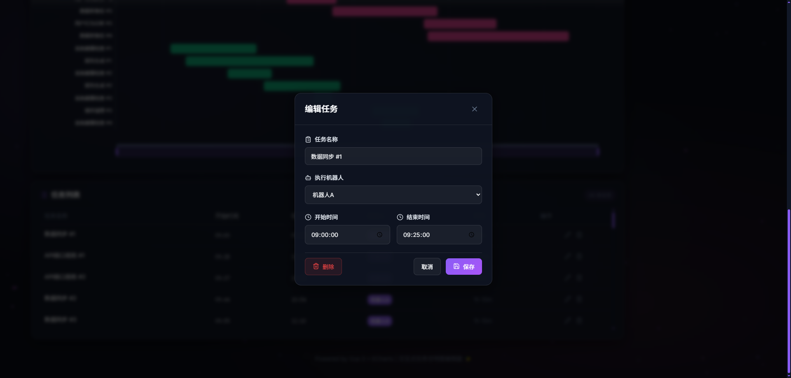
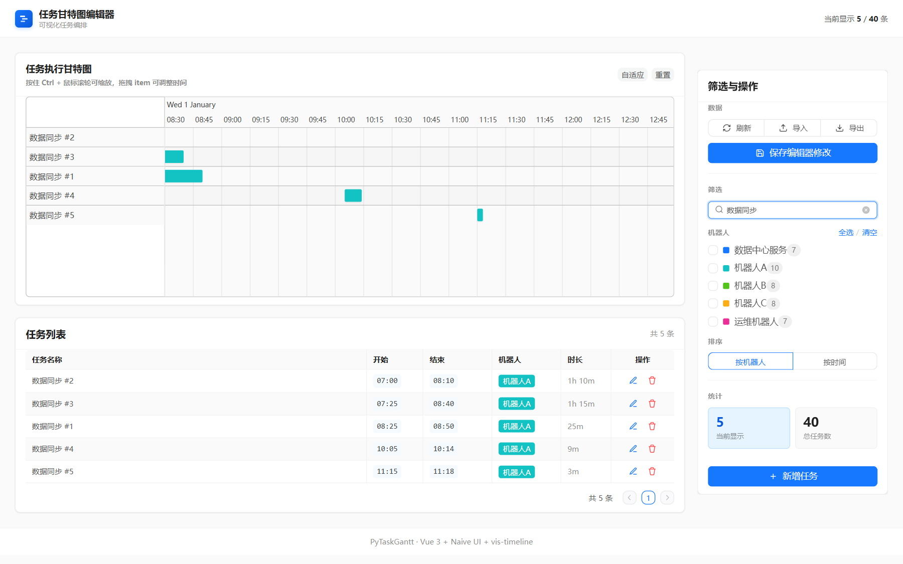
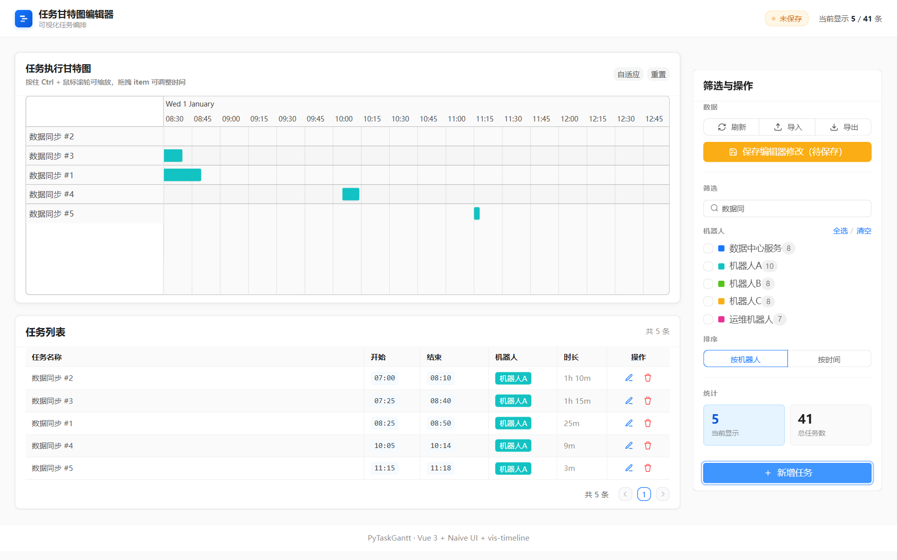

# PyTaskGantt

面向 RPA / 多机器人任务编排的交互式甘特图编辑器：拖拽改时间、筛选排序、CSV/JSON 双向导入导出，可切换文件或 PostgreSQL 持久化，一条 Docker 命令即可上线。




把一批「几点到几点、哪个机器人执行」的任务，画成一眼可读的时间轴：每个任务独占一行，配色按机器人稳定分配，鼠标拖一拖就能改时间。数据以 `Task,Start,Finish,Bot` 四列为核心，`HH:MM:SS` 计时，`Finish < Start` 自动识别为跨天。

## 功能特性

- **甘特图可视化** — 基于 vis-timeline，每个任务独占一行，颜色按机器人名稳定分配，悬浮显示起止时间与时长。
- **拖拽改时间** — 时间条左右拖拽即改起止；拖到视窗边缘时画布自动平移，任务条平滑跟随。
- **任务编辑器** — Modal 表单编辑任务名、机器人、起止时间；支持输入新机器人标签（自动补色）和「此刻」快捷填入。
- **搜索 · 筛选 · 排序** — 任务名模糊搜索、多选机器人过滤、三种排序（机器人名 / 开始 / 结束），甘特图与任务列表实时联动。
- **跨天识别** — `Finish < Start` 自动判定为跨越午夜，时长按次日正确计算。
- **CSV / JSON 双向互通** — 前端一键导入导出，数据语义与 Streamlit 参考版同源。
- **可切换存储** — 文件（JSON / CSV）或 PostgreSQL 两种后端，保存走增量差异更新，只写受影响的行。
- **一键容器化** — 多阶段 Docker 镜像，Express 单进程同时托管前端静态资源与 API，内置可选 Traefik 反代标签。
- **未保存提示** — Header 红点 + 保存按钮状态实时反映改动；「刷新」可丢弃本地拖拽/编辑，回到磁盘真相。

## 技术栈

| 层 | 技术 |
|:---|:---|
| 前端 | Vue 3 · Naive UI（Ant Design 风主题）· vis-timeline |
| 后端 | Express 5 · Node.js |
| 构建 | Vite 7 · concurrently |
| 存储 | JSON / CSV 文件 · PostgreSQL（`pg` 驱动，可选）|
| 部署 | Docker 多阶段构建 · Traefik（可选）|

## 快速开始

### 前置要求

- **Node.js 20.19+**（Vite 7 要求）与 npm
- （可选）**PostgreSQL 13+** — 仅在切换数据库存储时需要
- （可选）**Docker** — 容器化部署时需要

### 本地运行

```bash
cd vue
cp .env.example .env   # 首次运行：复制默认配置（端口 / CORS / 存储驱动）
npm install
npm start              # concurrently 同时拉起 Express 后端 + Vite 前端
```

启动后访问前端 http://localhost:5174 ，后端 API 监听 http://localhost:3002 。

也可以分别启动，或按需构建 / 迁移：

```bash
npm run server       # 仅后端（Express API）
npm run dev          # 仅前端（Vite dev server）
npm run build        # 生产构建，产物在 dist/
npm run migrate:pg   # 把文件数据迁入 PostgreSQL（见「架构」）
```

> [!TIP]
> 前端用 `window.location.hostname` 拼接后端地址，因此局域网内用本机 IP 直接访问也能连上后端，无需额外配置。

> [!NOTE]
> 为验证改动而启动的本地服务，测试完请主动停掉以释放端口（`:5174` / `:3002`）。Windows 下可用 `netstat -ano | findstr :5174` 找到 PID 后 `taskkill /PID <pid> /F`。

## 配置

`vue/.env`（不入库，从 `.env.example` 复制）是唯一的运行时配置源：

| 环境变量 | 说明 | 默认值 |
|:---|:---|:---|
| `PORT` | Express 后端端口（同时注入前端拼接 API 地址）| `3002` |
| `CORS_ORIGIN` | 跨域白名单，`*` 或逗号分隔域名 | `*` |
| `VITE_DEV_PORT` | Vite dev server 端口 | `5174` |
| `VITE_DEV_HOST` | Vite 监听地址（`0.0.0.0` 允许局域网访问）| `0.0.0.0` |
| `STORAGE_DRIVER` | 存储后端：`file` / `postgres` | `file` |
| `TASKS_FILE` | 文件存储路径，**扩展名决定读写格式**（`.csv` 走 CSV，其余当 JSON）| `src/data/tasks.json` |
| `DATABASE_URL` / `PG*` | PostgreSQL 连接串或分散变量（仅 `postgres` 模式）| — |

## 数据格式

核心数据模型只有四列，支持 CSV 导入导出，默认以 JSON 持久化到 `vue/src/data/tasks.json`：

```csv
Task,Start,Finish,Bot
数据同步#1,09:00:00,09:25:00,机器人A
日志分析#1,23:30:00,01:15:00,机器人B
```

| 字段 | 格式 | 说明 |
|:---|:---|:---|
| `Task` | 文本 | 任务名称 |
| `Start` | `HH:MM:SS` | 开始时间 |
| `Finish` | `HH:MM:SS` | 结束时间 |
| `Bot` | 文本 | 机器人 / 执行者名称 |

> [!NOTE]
> **跨天任务**：当 `Finish < Start`（定长字符串比较）时识别为跨越午夜，时长自动按次日计算。例如 `23:30:00 → 01:15:00` 记为 1h 45m。改动时间逻辑时务必验证这一场景。

## 界面预览

### 任务编辑器

Modal 表单编辑任务名（最长 100 字）、机器人（下拉选择或输入新标签、自动补全颜色）、起止时间（`HH:MM:SS` 时间选择器，含「此刻」快捷按钮）。跨天任务自动识别并以橙色提示条展示时长。



### 筛选与搜索

任务名模糊搜索、多选机器人筛选、三种排序方式。筛选后甘特图与任务列表同步更新，无匹配时显示空状态提示。



### 拖拽编辑时间

按住任务条左右拖拽即可调整起止时间。拖拽时显示浮动 tooltip（任务名、机器人色块、起止时间、时长），拖到视窗边缘自动平移画布，松手后立即反映到任务列表并亮起未保存红点。



## Docker 部署

生产环境推荐 Docker：多阶段构建（Node 20 Alpine）先用 Vite 打包前端，再由 Express 单进程同时托管静态资源与 API，通过数据卷持久化。

```bash
cd vue
cp docker-compose.yml.example docker-compose.yml   # 复制模板，按需修改域名 / 存储 / 证书
docker compose up -d --build                        # 构建镜像并后台启动
```

镜像内 Express 监听 `3002`，通过 `pytaskgantt-data` 数据卷持久化 `/app/data`，容器重建不丢数据；内置 `HEALTHCHECK` 探测 `/api/health`。

`docker-compose.yml` 的 `environment` 段覆盖运行时配置，语义与 `.env` 一致（`PORT` / `CORS_ORIGIN` / `STORAGE_DRIVER` / `TASKS_FILE` / `DATABASE_URL`）。

### Traefik 反向代理（可选）

模板内置 Traefik labels 供已有 Traefik 实例自动发现，配好即可 HTTPS 对外。

> [!WARNING]
> `traefik.http.routers.pytaskgantt.tls.certresolver` **必须填 Traefik 实例里实际存在的证书解析器名字**，否则路由被静默丢弃、浏览器报 `ERR_CONNECTION_CLOSED`。查询方法：
> ```bash
> docker inspect <traefik容器> | grep certificatesresolvers
> # 取 --certificatesresolvers.<名字>.acme... 中的 <名字> 填入 label
> ```
> 同时把路由 `rule` 里的 `Host(...)` 换成你的域名，`networks` 与 Traefik 所在 external 网络同名。不用 Traefik 时可改用 `ports:` 直接映射 `3002`，或换 Nginx / Caddy。

常用运维命令：

```bash
docker compose ps                    # 查看容器状态
docker compose logs -f pytaskgantt   # 跟踪应用日志
docker compose up -d                 # 仅改 label / env 后热更新（无需 --build）
docker compose up -d --build         # 改了源码 / Dockerfile 后重新构建
```

## 架构

### 后端 API（`vue/server.cjs`）

单文件 Express 5，读写统一经 `storage/` 抽象层分发，5 个端点：

| 方法 | 路径 | 说明 |
|:---|:---|:---|
| `GET` | `/api/health` | 健康检查（Docker HEALTHCHECK / 探活）|
| `GET` | `/api/tasks` | 读取全部任务 |
| `POST` | `/api/tasks` | 保存（file 整文件重写 / postgres 增量差异更新）|
| `POST` | `/api/import` | 导入 CSV / JSON（整体替换）|
| `GET` | `/api/export/:format` | 导出 `csv` / `json` |

### 前端

- `src/services/dataService.js` — 唯一数据层：API 调用、时间/颜色/时长工具、以及未保存状态的真相源。
- `src/components/GanttChart.vue` — vis-timeline 甘特图与拖拽逻辑（含边缘自动平移）。
- `src/components/TaskList.vue` · `TaskEditor.vue` · `FilterPanel.vue` — 任务表格、编辑 Modal、筛选与操作面板。
- `src/theme.js` — Naive UI 的 Ant Design 风主题与机器人调色板 `BOT_PALETTE`。

### 存储层

`STORAGE_DRIVER` 切换后端，二者同源数据语义：

- **`file`（默认）** — 按 `TASKS_FILE` 扩展名自动选择 JSON / CSV 读写，零依赖开箱即用。
- **`postgres`** — 单表 `rpa_tasks`，保存做增量差异更新。**应用不建表**，需手动执行 `storage/schema.sql`；用 `npm run migrate:pg` 可把现有文件数据迁入库。详见 [vue/POSTGRESQL.md](vue/POSTGRESQL.md)。

## 项目结构

```
PyTaskGantt/
├── ShadowBot_tasks.csv          # 示例 CSV 数据
├── images/                      # README 截图
├── vue/                         # 首选实现（Vue 3 + Express 5）
│   ├── server.cjs               # Express 后端（5 个端点）
│   ├── vite.config.js
│   ├── Dockerfile               # 多阶段构建镜像
│   ├── docker-compose.yml.example  # Compose 模板（含 Traefik labels）
│   ├── POSTGRESQL.md            # PostgreSQL 存储说明
│   ├── lib/csv.cjs              # CSV 解析工具
│   ├── storage/                 # 存储后端：file / postgres + schema.sql
│   └── src/
│       ├── App.vue              # 根组件（Shell + 编排）
│       ├── theme.js             # Naive UI 主题与调色板
│       ├── components/          # GanttChart / TaskList / TaskEditor / FilterPanel
│       ├── services/dataService.js  # 唯一数据层
│       └── data/tasks.json      # 默认示例数据
└── streamlit/                   # Python 参考实现（对照基准）
    └── create_gantt.py          # 单文件 Streamlit + Plotly + Pandas
```

## Streamlit 参考实现

`streamlit/` 是一份纯 Python 单文件实现（Streamlit + Plotly + Pandas），与 Vue 版共用 `Task,Start,Finish,Bot` 数据语义，主要用作对照基准。

```bash
cd streamlit
copy .env.example .env    # 首次：复制默认数据源配置
start.bat                 # Windows：uv 一键启动，http://localhost:8501
```

> [!NOTE]
> Streamlit 版仅读写 CSV，数据文件路径由 `streamlit/.env` 的 `TASKS_FILE` 控制。日常开发集中在 `vue/`。
