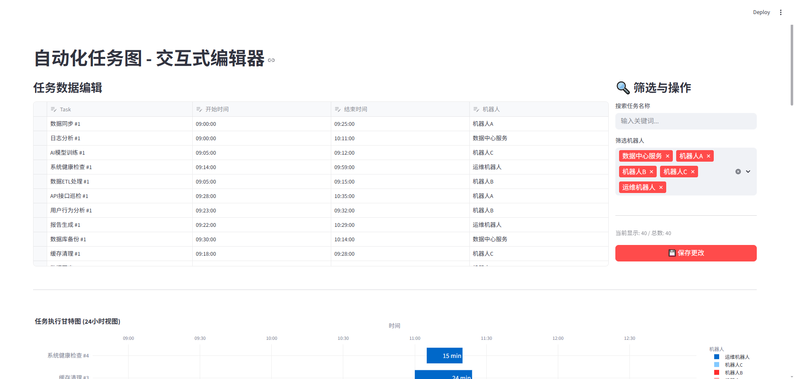
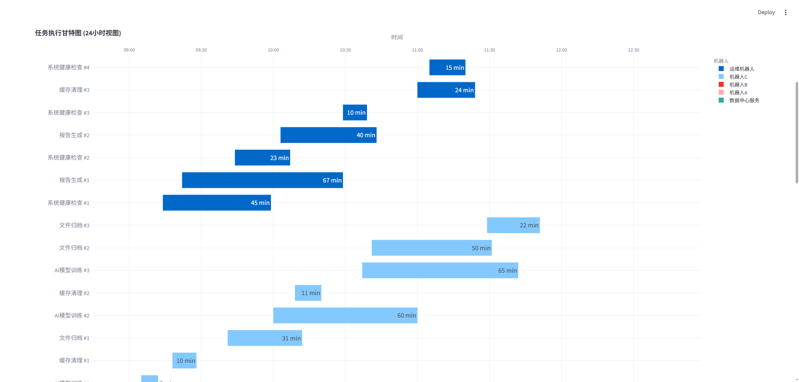
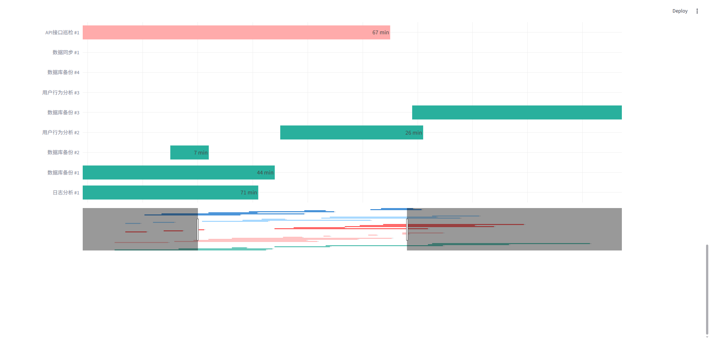

# 交互式任务甘特图编辑器

这是一个使用 **Python** 和 **Streamlit** 构建的交互式Web应用程序，旨在将自动化任务的计划可视化为一个功能强大的甘特图仪表盘。

与简单的图表生成不同，本项目提供了一个完整的Web界面，允许用户**直接在浏览器中实时编辑任务数据**，并一键将修改保存回源文件。

因为我的需求只需要时间范围为一天以内，故未对跨日期进行测试。

## 主要特性

- **Web应用界面**: 无需运行零散的脚本，通过一个命令启动一个完整的Web服务。
- **实时编辑与预览**: 在网页上提供一个类似Excel的表格，对任务数据的任何修改（增、删、改）都会**即时**反映在下方的甘特图上。
- **强大的筛选功能**: 集成**任务名称模糊搜索**和**机器人多选过滤**功能，帮助用户快速定位和管理特定任务。
- **保存更改**: “保存更改”按钮现已集成在**右侧的筛选与操作面板**中，用户可以随时将网页上的所有修改**持久化**写回 `tasks.csv` 文件。
- **优化甘特图可视化**: 任务条的粗细、文字大小、与任务名称的对齐都经过优化，提供更清晰易读的视图。
- **动态时间轴**: 时间轴默认显示所有任务的实际跨度（前后有缓冲），并支持通过滑块进行独立缩放，便于查看分钟级任务细节。
- **智能分类**: 自动根据“运行机器人”字段对任务进行颜色编码，并生成图例。

## 环境要求

- Python 3.7+ （测试版本为3.7）
- **关键库**: Streamlit, Pandas, Plotly

## 使用方法

1.  **准备数据文件**:
    确保项目目录下有一个名为 `tasks.csv` 的文件，该文件必须包含以下四列：`Task`, `Start`, `Finish`, `Bot`。
    - `Task`: 任务的唯一名称（字符串）。
    - `Start`: 任务的开始时间，格式为 `HH:MM:SS`。**（注意：日期信息将被程序忽略，仅保存和处理时间）**
    - `Finish`: 任务的结束时间，格式为 `HH:MM:SS`。**（注意：日期信息将被程序忽略，仅保存和处理时间）**
    - `Bot`: 执行该任务的机器人或服务名称，用于颜色分类（字符串）。
    - 日期如果为空，则默认为当日日期
    **文件示例:**
    ```csv
    Task,Start,Finish,Bot
    数据同步#1,09:08:00,09:25:00,机器人A
    日志分析#1,09:01:00,10:11:00,数据中心服务
    ...
    ```

2.  **启动Web应用**:
    打开终端后使用 `streamlit run` 命令启动应用：
    ```bash
    streamlit run create_gantt.py
    ```

3.  **在浏览器中操作**:
    -   命令运行后，浏览器会自动打开一个新的标签页（通常是 `http://localhost:8501`）。
    -   页面现在分为**左右两栏**：
        -   **左侧 (数据编辑区)**：提供类似Excel的表格，您可以像操作Excel一样修改、添加或删除任务。
        -   **右侧 (筛选与操作面板)**：
            -   使用“搜索任务名称”文本框进行模糊搜索。
            -   通过“筛选机器人”多选框选择要显示的机器人任务。
            -   点击顶部的“💾 保存更改”按钮，即可将所有变动（即使是在筛选视图下编辑的）合并并写入 `tasks.csv` 文件。
    -   下方的**甘特图会实时更新**以反映数据的改动。

4.  **停止应用**:
    在终端按下 `Ctrl + C` 即可停止Web服务。

## 效果图展示

### 1. 交互式编辑界面
应用的核心功能：上方是可直接编辑的数据表格，下方是实时同步更新的甘特图。



### 2. 全局任务概览
展示所有任务的分布情况，并通过颜色区分不同机器人。当任务数量多时，可上下滚动页面。



### 3. 时间轴缩放细节
拉长时间轴查看特定时间段内的任务细节，而Y轴的任务列表保持固定。

