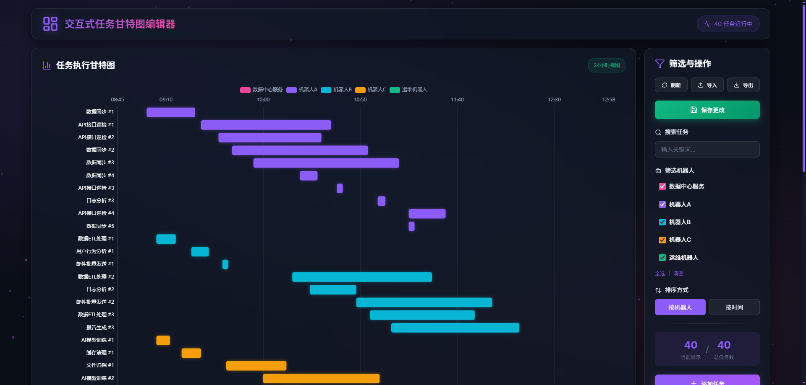

# PyTaskGantt - 交互式任务甘特图编辑器

一个用于可视化自动化任务计划的甘特图仪表盘，提供两种技术栈实现。

## 📦 版本选择

| 版本 | 目录 | 技术栈 | 特点 |
|------|------|--------|------|
| **Vue 版本** | [vue/](./vue/) | Vue 3 + ECharts + Express | 现代化 UI、粒子背景、深色主题 |
| **Streamlit 版本** | [streamlit/](./streamlit/) | Python + Streamlit + Plotly | 经典版本、简单部署 |

## 🚀 快速开始

### Vue 版本（推荐）

```bash
cd vue

# 一键启动（双击 start.bat）
# 或手动启动：
npm install
npm run server  # 终端1: 后端 API
npm run dev     # 终端2: 前端页面
```

访问: http://localhost:5173

### Streamlit 版本

```bash
cd streamlit
pip install streamlit pandas plotly
streamlit run create_gantt.py
```

访问: http://localhost:8501

---

## 📸 效果预览

### Vue 版本

#### 甘特图主界面
深色赛博朋克主题，动态粒子背景，玻璃态 UI 设计。



#### 任务编辑
优雅的模态框设计，表格形式快速编辑。


---

### Streamlit 版本

#### 编辑界面
类似 Excel 的表格编辑，实时同步甘特图。


#### 甘特图可视化
Plotly 驱动的交互式图表，支持缩放和筛选。


---

## 📊 数据格式

两个版本使用相同的 CSV 数据格式：

```csv
Task,Start,Finish,Bot
数据同步#1,09:00:00,09:25:00,机器人A
日志分析#1,10:00:00,10:30:00,机器人B
```

| 字段 | 说明 |
|------|------|
| Task | 任务名称 |
| Start | 开始时间 (HH:MM:SS) |
| Finish | 结束时间 (HH:MM:SS) |
| Bot | 机器人/执行者名称 |

## ✨ 功能对比

| 功能 | Vue 版本 | Streamlit 版本 |
|------|:--------:|:--------------:|
| 甘特图可视化 | ✅ | ✅ |
| 任务编辑 | ✅ | ✅ |
| 搜索筛选 | ✅ | ✅ |
| 数据保存 | ✅ | ✅ |
| CSV导入导出 | ✅ | ✅ |
| 深色主题 | ✅ | ❌ |
| 粒子动画 | ✅ | ❌ |
| 玻璃态UI | ✅ | ❌ |
| 任务列表视图 | ✅ | ❌ |

## 📁 项目结构

```
PyTaskGantt/
├── README.md              # 项目主文档
├── ShadowBot_tasks.csv    # 示例数据
├── images/                # 文档图片
├── vue/                   # Vue 3 版本
│   ├── start.bat          # 一键启动
│   ├── stop.bat           # 停止服务
│   ├── server.cjs         # 后端 API
│   └── src/               # 前端源码
└── streamlit/             # Streamlit 版本
    ├── create_gantt.py    # 主程序
    └── ShadowBot_tasks.csv # 数据文件
```

## 📝 License

MIT